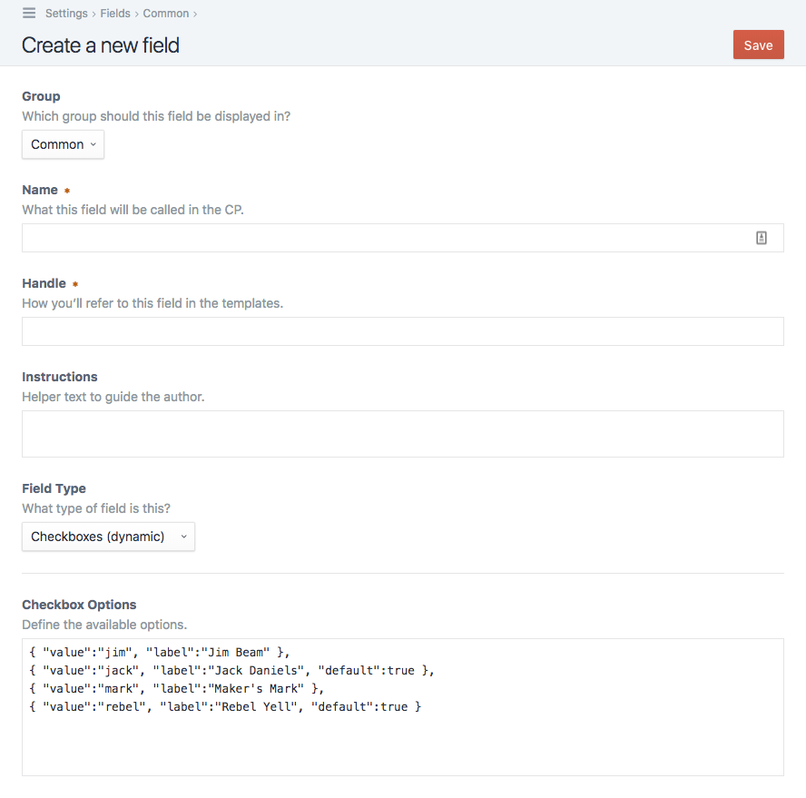
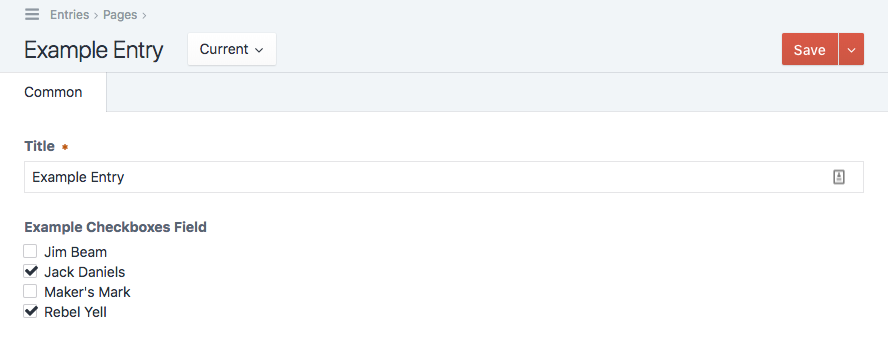
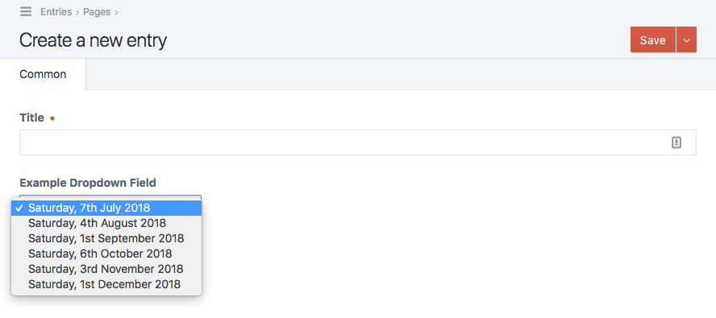
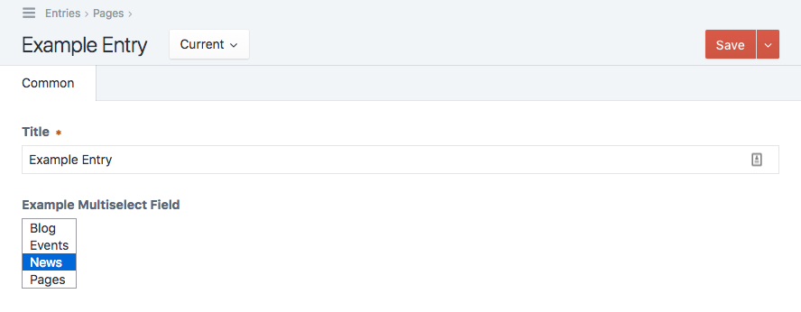
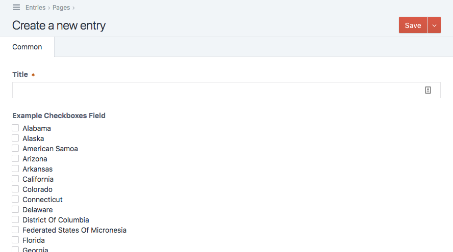

# Craft Dynamic Fields plugin for Craft CMS 3.x

Populate Craft fields with dynamic data using the power of Twig.

## Requirements

This plugin requires Craft CMS 3.0.0 or later.

## Installation

To install the plugin, follow these instructions.

1. Open your terminal and go to your Craft project:

        cd /path/to/project

2. Then tell Composer to load the plugin:

        composer require lewisjenkins/craft-dynamic-fields

3. In the Control Panel, go to Settings → Plugins and click the “Install” button for Craft Dynamic Fields.

## Craft Dynamic Fields Overview

This plugin adds the following fieldtypes:

- Checkboxes (dynamic)
- Dropdown (dynamic)
- Multi-select (dynamic)
- Radio Buttons (dynamic)

#### Simple example

You can populate the options for each fieldtye as a JSON array, like this :

    { "value":"jim", "label":"Jim Beam" },
    { "value":"jack", "label":"Jack Daniels", "default":true },
    { "value":"mark", "label":"Maker's Mark" },
    { "value":"rebel", "label":"Rebel Yell", "default":true }

This is a simple example of a checkboxes field with two of the four options selected by default.

No big deal, right? But the real power of this plugin is the ability to dynamically populate your fields using Twig logic.

#### All entries, ordered by title

    
        {{ loop.index > 1 ? ',' }} {    
            "value":"{{ entry.id }}",
            "label":"{{ entry|e }}",
            "default":{{ entry.slug == 'home' ? 'true' : 'false' }}
        }
    

Here is a radiobuttons field containing all current entries, ordered by title, with the homepage selected by default.

Because you're able to use Twig to create field options, you can do all kinds of crazy things.

#### Every first Saturday of the month

    
        
        {{ loop.index > 1 ? ',' }} {
            "value":"{{ eventDate|date('Y-m-d') }}",
            "label":"{{ eventDate|date("l, jS F Y") }}"
        }
    

This is a dynamic dropdown field with options for every first Saturday for the next six months.

#### All sections

    
        {{ loop.index > 1 ? ',' }} {    
            "value":"{{ section.id }}",
            "label":"{{ section|e }}"
        }
    

Here is a multi-select field containing all sections.

#### Template example

You can even configure your field options in a separate template file.

    

<!-- -->

    # templates/_dynamicfields/usStates.json

    { "label":"Alabama", "value":"AL" }, { "label":"Alaska", "value":"AK" }, { "label":"American Samoa", "value":"AS" }, { "label":"Arizona", "value":"AZ" }, { "label":"Arkansas", "value":"AR" }, { "label":"California", "value":"CA" }, { "label":"Colorado", "value":"CO" }, { "label":"Connecticut", "value":"CT" }, { "label":"Delaware", "value":"DE" }, { "label":"District Of Columbia", "value":"DC" }, { "label":"Federated States Of Micronesia", "value":"FM" }, { "label":"Florida", "value":"FL" }, { "label":"Georgia", "value":"GA" }, { "label":"Guam", "value":"GU" }, { "label":"Hawaii", "value":"HI" }, { "label":"Idaho", "value":"ID" }, { "label":"Illinois", "value":"IL" }, { "label":"Indiana", "value":"IN" }, { "label":"Iowa", "value":"IA" }, { "label":"Kansas", "value":"KS" }, { "label":"Kentucky", "value":"KY" }, { "label":"Louisiana", "value":"LA" }, { "label":"Maine", "value":"ME" }, { "label":"Marshall Islands", "value":"MH" }, { "label":"Maryland", "value":"MD" }, { "label":"Massachusetts", "value":"MA" }, { "label":"Michigan", "value":"MI" }, { "label":"Minnesota", "value":"MN" }, { "label":"Mississippi", "value":"MS" }, { "label":"Missouri", "value":"MO" }, { "label":"Montana", "value":"MT" }, { "label":"Nebraska", "value":"NE" }, { "label":"Nevada", "value":"NV" }, { "label":"New Hampshire", "value":"NH" }, { "label":"New Jersey", "value":"NJ" }, { "label":"New Mexico", "value":"NM" }, { "label":"New York", "value":"NY" }, { "label":"North Carolina", "value":"NC" }, { "label":"North Dakota", "value":"ND" }, { "label":"Northern Mariana Islands", "value":"MP" }, { "label":"Ohio", "value":"OH" }, { "label":"Oklahoma", "value":"OK" }, { "label":"Oregon", "value":"OR" }, { "label":"Palau", "value":"PW" }, { "label":"Pennsylvania", "value":"PA" }, { "label":"Puerto Rico", "value":"PR" }, { "label":"Rhode Island", "value":"RI" }, { "label":"South Carolina", "value":"SC" }, { "label":"South Dakota", "value":"SD" }, { "label":"Tennessee", "value":"TN" }, { "label":"Texas", "value":"TX" }, { "label":"Utah", "value":"UT" }, { "label":"Vermont", "value":"VT" }, { "label":"Virgin Islands", "value":"VI" }, { "label":"Virginia", "value":"VA" }, { "label":"Washington", "value":"WA" }, { "label":"West Virginia", "value":"WV" }, { "label":"Wisconsin", "value":"WI" }, { "label":"Wyoming", "value":"WY" }

 <!-- _v_ -->

#### Advanced examples

... coming soon ...

---

Brought to you by [Lewis Jenkins](https://lj.io)
